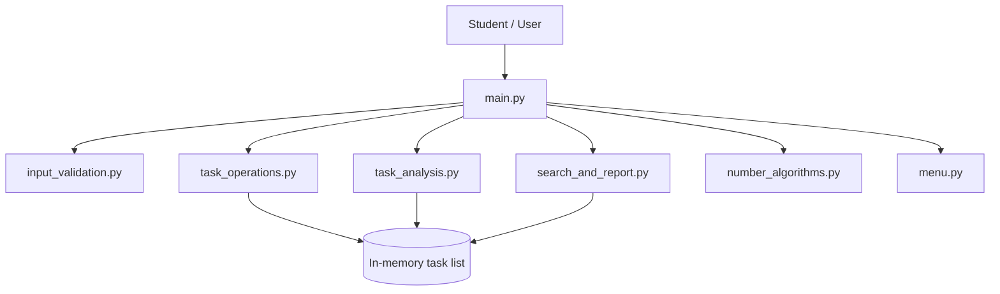
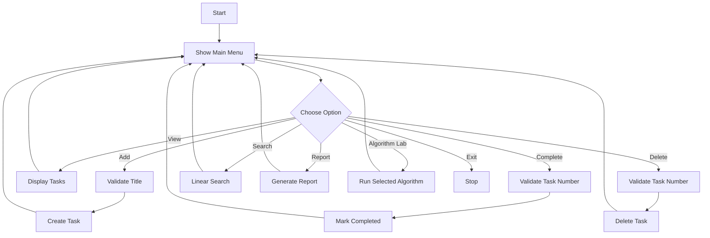
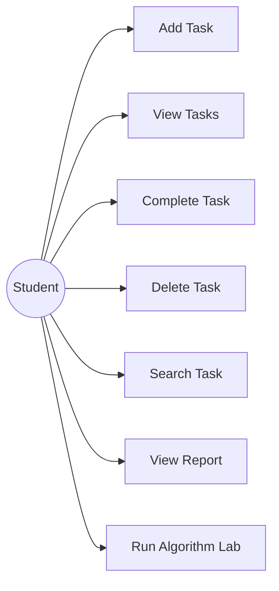
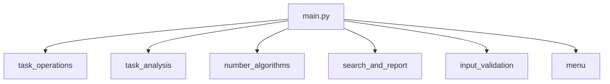
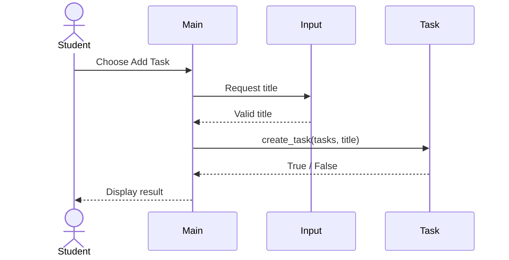

# Design Diagrams

The diagrams below can be pasted into a Mermaid-compatible Markdown viewer or recreated in a diagram tool for the final report.

## System Architecture Diagram



## Workflow Diagram



## Use Case Diagram



## Component Diagram



## Sequence Diagram: Add Task



## Storage Design

There is no database in the current project.

The in-memory representation is:

```text
tasks = [
    {"title": "Study Python", "status": "Pending"},
    {"title": "Complete assignment", "status": "Completed"}
]
```

An ER diagram is therefore not applicable to the current implementation.
